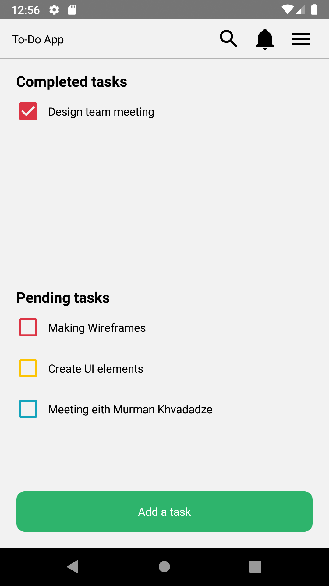
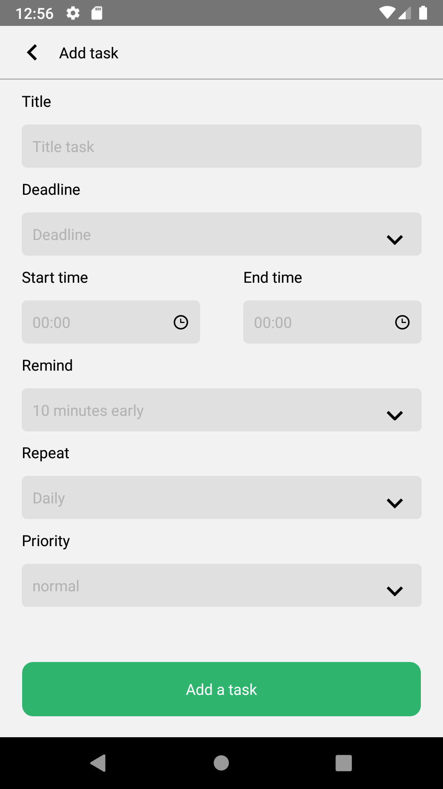
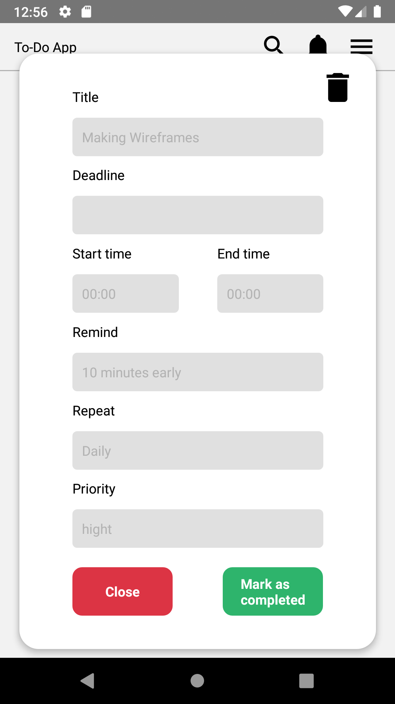

# ToDo App
Aplicacion de tareas hecha solo para android ya que no tengo una mac para compilar la version IOS

## Enlace de un video de prueba
https://www.youtube.com/watch?v=UvT2HtQKaSQ

# Getting Started

#### npm install
### react-native link react-native-vector-icons

# Librerias utilizadas
### react-native-modal-datetime-picker
### @react-navigation v5
### react-native-vector-icons
### styled-components

# Capturas de pantalla

